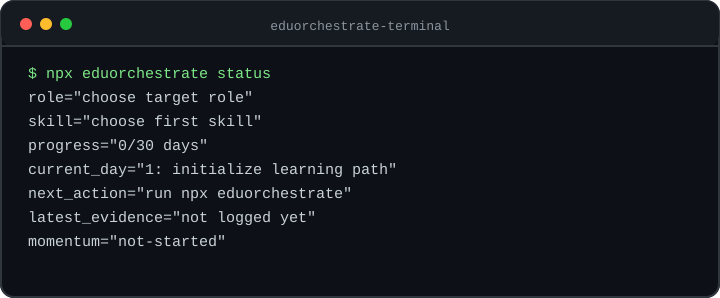
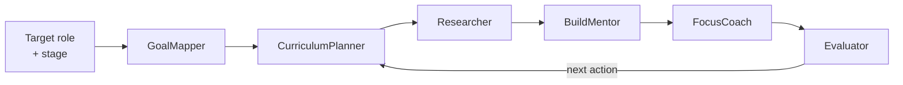

<div align="center">



# EduOrchestrate

https://playground.likec4.dev/share/qqCwxBrq0d/

### Turn any AI coding agent into a daily learning command center.

**One command** turns a target job role into an adaptive plan, trend-aware research, daily emails, and a skill progression card — running locally inside the agent you already use. Your data, your machine.

<p>
  <a href="https://www.npmjs.com/package/eduorchestrate"></a>
  <a href="https://www.npmjs.com/package/eduorchestrate"></a>
  <a href="https://nodejs.org"></a>
  <a href="LICENSE"></a>
  
  <a href="https://github.com/haroontrailblazer/EduOrchestrate/pulls"></a>
</p>

<p>
  <a href="#quickstart">Quickstart</a> ·
  <a href="#what-it-does">Features</a> ·
  <a href="#supported-agents">Agents</a> ·
  <a href="#the-cli">CLI</a> ·
  <a href="#how-it-works">How it works</a> ·
  <a href="#faq">FAQ</a>
</p>

</div>

---

## Why EduOrchestrate?

Most learning tools are SaaS dashboards that collect courses you never finish. EduOrchestrate is the opposite: a **vendor-neutral learning coach that lives in your CLI**. It turns "I want to become an Agentic AI Engineer" into a concrete daily loop — one core topic, one build artifact, one review — with sourced research and proof of progress.

> **Job boards use AI to filter candidates. EduOrchestrate gives the learner AI to build a daily, sourced path to the job — one artifact at a time.**

-  &nbsp;**Role → plan in one command.** Pick a target role and a first skill; get an adaptive plan with a fixed **30-day minimum**.
-  &nbsp;**AI-native & agnostic.** The same `/eduorchestrate` skill works across Claude Code, Codex, Gemini, OpenClaw, Antigravity, Hermas, and any MCP agent.
-  &nbsp;**Local-first & private.** Learning state stays in `data/`; SMTP secrets live in `.env.local` or GitHub Actions — never committed.
-  &nbsp;**Zero dependencies.** A dependency-free Node CLI. Audit it in an afternoon.
-  &nbsp;**Open source, MIT.** No account, no paywall, no telemetry.

---

##  Quickstart

From an agent terminal in your project:

```bash
npx eduorchestrate
```

That's it. The interactive setup captures your profile (name, email, target role, current topic, **first-skill focus**, stage, plan length, daily email time, timezone, SMTP), writes the agent adapters, and generates your first 30-day plan.

<div align="center"><sub>Requires Node 18+. Nothing to install globally — <code>npx</code> handles it.</sub></div>

---

##  What it does

<table>
<thead><tr><th width="44"></th><th>Feature</th><th>Description</th></tr></thead>
<tbody>
<tr><td align="center"></td><td><b>Adaptive role plans</b></td><td>Learner-chosen length with a fixed 30-day minimum. One topic, one build artifact, one review loop per day.</td></tr>
<tr><td align="center"></td><td><b>Trend-aware research</b></td><td>Daily digests of dated, sourced updates from official docs, YouTube search, and GitHub sample code — and only reshapes the roadmap when a trend improves employability.</td></tr>
<tr><td align="center"></td><td><b>Daily email delivery</b></td><td>Preview with <code>--dry-run</code>, then send the day's plan over your own SMTP.</td></tr>
<tr><td align="center"></td><td><b>Autonomous runner</b></td><td>A generated GitHub Actions workflow delivers your daily plan hands-free — no browser or agent session needs to stay open.</td></tr>
<tr><td align="center"></td><td><b>Skill progression cards</b></td><td>Prebuilt, GitHub-style SVG terminal cards showing role, skill, momentum, and next action.</td></tr>
<tr><td align="center"></td><td><b>Course source packs</b></td><td>Role-specific official catalogs, free-course discovery links from major vendors, and newsletter feeds.</td></tr>
<tr><td align="center"></td><td><b>Token-conscious harness</b></td><td>Tells the agent what to load first, when to research, and what <i>not</i> to paste into chat.</td></tr>
<tr><td align="center"></td><td><b>Progress & reviews</b></td><td>Evidence logging, weekly summaries, and a <code>recommend-next</code> that suggests your next skill after the plan window.</td></tr>
</tbody>
</table>

### Built-in role blueprints

<table>
<tr>
<td width="25%" align="center"><br/><b>Agentic AI & LLM Engineer</b><br/><sub>RAG, evals, agent workflows</sub></td>
<td width="25%" align="center"><br/><b>Full-Stack Developer</b><br/><sub>Web, cloud, CI/CD</sub></td>
<td width="25%" align="center"><br/><b>Cybersecurity Analyst</b><br/><sub>SOC, SIEM, cloud security</sub></td>
<td width="25%" align="center"><br/><b>Data Scientist</b><br/><sub>Data eng, analytics, ML</sub></td>
</tr>
</table>

> For other roles, EduOrchestrate infers the closest blueprint and keeps the plan artifact-driven.

---

##  Supported agents

The same `/eduorchestrate` command is honored across runtimes — setup writes the right adapter for each. Where a runtime can't register slash commands, it treats `use EduOrchestrate` as equivalent to `/eduorchestrate`.

| Agent | Adapter written on setup |
|---|---|
| **Claude Code** | `.claude/skills/eduorchestrate/SKILL.md` |
| **Codex** / generic coding agents | `AGENTS.md` |
| **Gemini** | `GEMINI.md` |
| **OpenClaw** | `.eduorchestrate/adapters/openclaw/SKILL.md` |
| **Antigravity** | `.eduorchestrate/adapters/antigravity/manifest.json` |
| **Hermas** | `.eduorchestrate/adapters/hermas/manifest.json` |
| **MCP-capable agents** | `.eduorchestrate/mcp/manifest.json` |

---

##  The CLI

Everything runs from one dependency-free CLI. State writes to `data/` and is git-ignored by default.

```bash
# Plan
npx eduorchestrate plan --role "Agentic AI and LLM Engineer"
npx eduorchestrate plan --role "Agentic AI and LLM Engineer" --skill "RAG evaluation" --days 45

# Daily loop
npx eduorchestrate harness                     # load the token-conscious harness
npx eduorchestrate courses                      # role-specific course + newsletter packs
npx eduorchestrate research --day 1             # dated, sourced trend digest
npx eduorchestrate send-today --dry-run         # preview the daily email
npx eduorchestrate send-today                   # send for real (your SMTP)
npx eduorchestrate log-progress --day 1 --completed "Built setup" --evidence "Repo link"

# Review & cards
npx eduorchestrate status                       # current role, skill, day, next action
npx eduorchestrate weekly-summary --week 1
npx eduorchestrate progress-card                # GitHub-style skill card (md + json)
npx eduorchestrate terminal-card                # terminal-style SVG card
npx eduorchestrate recommend-next               # next skill after the plan window

# Setup helpers
npx eduorchestrate setup-secrets                # prints `gh secret set` commands for Actions email
npx eduorchestrate doctor                       # verifies skill, adapters, config, env files
```

<details>
<summary><b>Command reference</b></summary>

| Command | What it does |
|---|---|
| `plan` | Generate an adaptive plan (`--role`, `--skill`, `--days`; 30-day minimum enforced). |
| `harness` | Write the compact execution harness (`data/eduorchestrate-harness.json` / `.md`). |
| `courses` | Write role-specific learning sources (`data/learning-sources.json` / `.md`). |
| `research` | Produce a dated, sourced trend digest for a given `--day`. |
| `send-today` | Send today's plan email (`--dry-run` previews without sending). |
| `log-progress` | Record completed work + evidence for a day. |
| `status` | Print current role, skill, progress, current day, and next action. |
| `weekly-summary` | Summarize a `--week` of progress. |
| `progress-card` / `terminal-card` | Render learner-specific progression cards. |
| `recommend-next` | Suggest the next skill once the plan window completes. |
| `setup-secrets` | Print the `gh secret set` commands for Actions email delivery. |
| `doctor` | Diagnose the repo's skill, adapter, config, and environment files. |

</details>

---

##  How it works

EduOrchestrate models the system as a **typed multi-agent workflow** — even when a single model executes it:



| Agent | Responsibility |
|---|---|
| **GoalMapper** | Translate target role + stage into priority skills. |
| **CurriculumPlanner** | Create milestones and a daily focus plan. |
| **Researcher** | Gather dated, sourced updates from official docs and release notes. |
| **BuildMentor** | Turn topics into practical projects with deliverables. |
| **FocusCoach** | Limit scope and prevent resource overload. |
| **Evaluator** | Review evidence and adjust the next action. |

Each day becomes **one build action with visible proof** — research current references, practice one focused skill, preview or send the email, log evidence, keep the next action visible.

---

##  Autonomous daily delivery

EduOrchestrate doesn't need a browser window or an open agent session to deliver. On setup it writes `.github/workflows/eduorchestrate-daily.yml`, which runs in **GitHub Actions** at your configured time:

- Runs `node bin/eduorchestrate.js send-today` on schedule.
- Pulls SMTP credentials from **GitHub Actions secrets** (`setup-secrets` prints the exact `gh secret set` commands).
- Advances the day from `schedule.startDate` and **stops after the plan window** instead of repeating the same day forever.

> `send-today --dry-run` is always a safe preview. `send-today` sends real email. Adapters follow the same resume rule everywhere: on resume, load the harness/status, resolve today's day, and only send after SMTP setup is approved.

---

##  Configuration & state

| What | Where | Committed? |
|---|---|---|
| Plans, digests, logs, cards | `data/` | No — git-ignored |
| SMTP secrets | `.env.local` or GitHub Actions secrets | No — never |
| Schedule / profile config | `eduorchestrate.config.json` | Yes (no secrets) |

---

##  Architecture

```
src/
├── cli.js                 # dependency-free command router
├── planner.js             # role blueprints + adaptive plan generation
├── adapters.js            # writes per-agent adapter files
├── workflow.js            # GitHub Actions runner generator
├── research.js            # official docs / YouTube / GitHub-sample digests
├── courses.js             # role-specific course + newsletter source packs
├── harness.js             # token-conscious execution harness
├── progress.js            # progress log, status, weekly summaries
├── progression-card.js    # role/skill + terminal card generation
├── card-components.js     # compact SVG component renderer
├── email.js               # SMTP mailer
└── config.js              # config + data-dir resolution
skills/eduorchestrate/     # canonical universal skill + assets + references
tests/node/                # Node regression tests
```

---

##  Development

```bash
git clone https://github.com/haroontrailblazer/EduOrchestrate.git
cd EduOrchestrate
npm test            # run the Node regression suite
npx .               # run the CLI locally before publishing
```

The whole CLI is dependency-free and runs on Node 18+. There is no build step.

---

##  FAQ

<details>
<summary><b>Is it really free? What's the license?</b></summary>

Yes — MIT-licensed and open source, with zero runtime dependencies. No account, no paywall, no telemetry. The only thing you pay for is whichever AI coding CLI you already use.
</details>

<details>
<summary><b>Where does my data go?</b></summary>

Local. Plans, research digests, progress logs, and cards write to <code>data/</code>, which is git-ignored. SMTP credentials live in <code>.env.local</code> or GitHub Actions secrets — never in committed config.
</details>

<details>
<summary><b>Why a 30-day minimum?</b></summary>

A month is the floor for building real, demonstrable momentum on a job role. You can request a longer plan, but if you ask for fewer than 30 days it still generates 30.
</details>

<details>
<summary><b>Which agents does it work with?</b></summary>

Claude Code, Codex and generic coding agents (<code>AGENTS.md</code>), Gemini, OpenClaw, Antigravity, Hermas, and any MCP-capable agent. See <a href="#supported-agents">Supported agents</a>.
</details>

<details>
<summary><b>How does daily email work without keeping anything open?</b></summary>

A generated GitHub Actions workflow runs <code>send-today</code> on schedule using your stored secrets. Run <code>setup-secrets</code> to print the commands that store SMTP credentials as Actions secrets.
</details>

---

##  Contributing

Contributions are welcome! Whether it's a new **role blueprint**, an **agent adapter**, better **course sources**, or docs — open an issue or PR.

1. Fork & branch from `main`
2. Keep it dependency-free and add/adjust tests in `tests/node/`
3. Run `npm test`
4. Open a PR with a clear description

---

##  Star history

<a href="https://star-history.com/#haroontrailblazer/EduOrchestrate&Date">
  
</a>

---

##  License

[MIT](LICENSE) © EduOrchestrate — your data, your machine.

<div align="center">
<sub>Built for learners who want proof, not passive curriculum. Star the repo if it helps you land the role.</sub>
</div>
